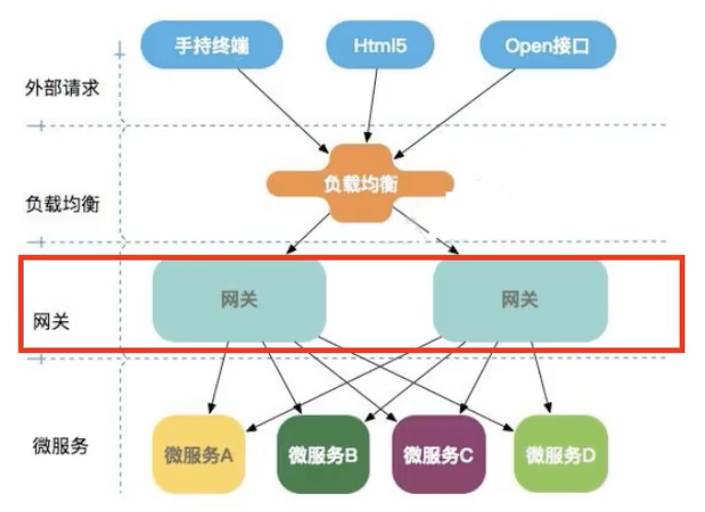

# 什么是Gateway
网关，用来统一路由的。比如我们不想将8001端口暴露给用户，我们可以让
用户请求Gateway，然后Gateway转发给8001，将8001的数据通过Gateway来给用户

## 处于开发的什么位置


# 基本内容
## 路由       Route
这是一个网关的基本模块，包含有ID，URI，断言和过滤器组成，如果断言为true，则匹配该路由
## 断言       Predicate
参考java.util.function.Predicate\
匹配HTTP请求中的内容，如果和Predicate相匹配，则匹配到该路由
## 过滤器     Filter
Spring 框架中的 GatewayFilter的实例，可以在路由前或路由后对数据进行修改

## 核心的逻辑
就是路由转发+执行过滤器链

# 配置路由
## 方法一：application配置
```yaml
spring:
  application:
    name: gateway
  cloud:
    gateway:
      routes:
        - id: payment-route1
          uri: http://localhost:8001
          predicates:
            - Path=/positive/**
        - id: payment-route2
          uri: http://localhost:8001
          predicates:
            - Path=/**
```
不说了

## 方法二：注入RouteLocator的Bean
```java
@SpringBootApplication
@EnableEurekaClient
@Configuration
public class GatewayGateway9527Application {

    public static void main(String[] args) {
        SpringApplication.run(GatewayGateway9527Application.class, args);
    }
    @Bean
    public RouteLocator routeLocator(RouteLocatorBuilder routeLocatorBuilder){
        RouteLocatorBuilder.Builder routes = routeLocatorBuilder.routes();
        routes.route("bean_route1",predicateSpec -> 
                    predicateSpec.path("/**")
                    .uri("https://news.baidu.com/")).build();
        return routes.build();
    }

}
```
> 意味着这个路径下的所有请求决斗将转发到`https://news.baidu.com/` 下。

# 动态路由
我们的service注册在注册中心，我们使用的大部分注册中心是适配于DiscoveryClient的\
比如 eureka, consul, zookeeper

首先我们要先启用这个功能：`spring.cloud.gateway.discovery.locator.enabled=true`
- 默认会给通过`DiscoveryClient`创建的路由去创建一个predicate和一个filter
- 默认的predicate是`/serviceId/**`
- 默认的filter的正则表达式是`/serviceId/(?<remaining>.*)`，正则中的可替换区是`/${remaining}`\

这样子我们就可以通过 `HttpPathOfGateway/serviceId/**`去访问我们的service了

也可以不使用这个功能，直接将`predicates.path`设置为`http://serviceId`也是可以的，
这样子我们的输入路径就是`predicates.path/**`

# 路由配置
## predicates
就是一堆匹配规则。

可以指定什么条件才能匹配到这个路由

## filters
有gatewayFilter\
有globalFilter\
有before\
有after\
官网上都有\
我们说一下自定义\
比如说我们需要自定义一个globalFilter：
```java
@Component
@Slf4j
public class UsernameFilter implements GlobalFilter, Ordered {

    @Override
    public Mono<Void> filter(ServerWebExchange exchange, GatewayFilterChain chain) {
        String username = exchange.getRequest().getQueryParams().getFirst("username");
        if (username==null){
            log.info("************username==null, invalid user");
            return exchange.getResponse().setComplete();
        }
        log.info("**********username="+username+", valid ok");
        return chain.filter(exchange);
    }

    @Override
    public int getOrder() {
        return 0;
    }
}
```
> order是决定filter的顺序
> setComplete表示结束了
> `chain.filter(exchange)`表示进入下一个filter
> 官网的例子有点不一样，不过都可以，无所谓